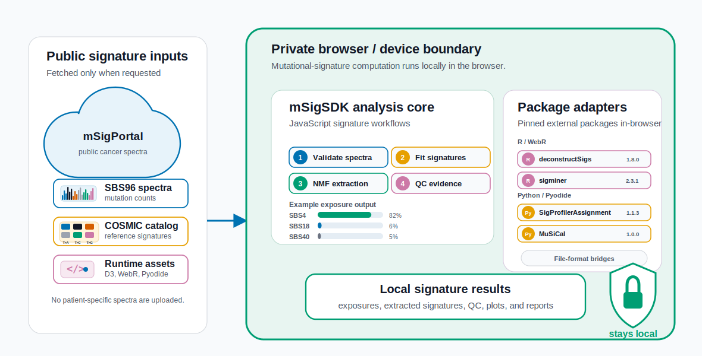

# mSigSDK: a browser-native JavaScript SDK for mutational-signature review, quality control, and reporting

Aaron Ge1,2*, Tongwu Zhang1, Yasmmin Cortes Martins3, Maria Teresa Landi1, Brian Park1, Kailing Chen1, Jeya Balasubramanian1, Jonas S Almeida1

1 Division of Cancer Epidemiology and Genetics, National Cancer Institute, National Institutes of Health, Maryland, USA
2 University of Maryland School of Medicine, Maryland, USA
3 National Laboratory of Scientific Computing, Petropolis, Brazil

*Correspondence: age1@som.umaryland.edu

## Abstract

### Background

Mutational-signature workflows often combine web portals, local R or Python packages, matrix conversion scripts, visualization notebooks, and manual report assembly. This fragmentation makes it difficult to embed signature review in web applications, share reproducible review artifacts, preserve provenance, and distinguish well-supported fitted exposures from estimates that are limited by mutation burden or assay design. Existing tools remain essential for production extraction and assignment, but they do not provide a reusable browser-native review layer for validation, quality control, interoperability, and reporting for precomputed spectra.

### Results

mSigSDK v0.3.0 is a JavaScript software development kit distributed as ECMAScript modules for browser-native mutational-signature review. It retrieves selected public resources from mSigPortal, The Cancer Genome Atlas (TCGA), and the Genomic Data Commons (GDC), imports local spectra or mutation annotation format (MAF)-like rows, validates matrix shape and context completeness, performs known-signature non-negative least-squares (NNLS) refitting, summarizes reconstruction and residual quality, estimates bootstrap uncertainty, evaluates threshold sensitivity, flags signature ambiguity and catalog sufficiency concerns, supports restricted-assay evidence tiers, renders profile-specific plots, and builds provenance-aware reports. MAF conversion preserves legacy SBS96 behavior and can also return SBS1536, DBS78, and ID83 spectra when required row-level evidence is present. External package adapters are pinned for deconstructSigs through WebR, sigminer through WebR, SigProfilerAssignment through Pyodide, and MuSiCal through Pyodide; when required package artifacts are unavailable, adapters report explicit availability errors instead of running JavaScript substitute algorithms. In a fresh Chrome profile, the zero-install demonstration loaded the SDK, fetched public PCAWG Lung-AdenoCA SBS96 data and the full COSMIC v3 SBS96 catalog, fitted one sample against 67 signatures, and generated a report in 1.894 seconds. Internal NNLS, NMF, and QC checks passed against SciPy, R nnls, scikit-learn, and independent Python implementations. Browser adapter outputs matched local comparator package execution for deconstructSigs, sigminer, SigProfilerAssignment, and MuSiCal across 38 public spectra and 67 COSMIC SBS signatures.

### Conclusions

mSigSDK provides a browser-native review, quality-control, interoperability, and reporting layer for mutational-signature workflows. It complements production extraction and assignment packages by making spectra, fitted exposures, warnings, provenance, and reports easier to embed, inspect, share, and reproduce.

**Keywords:** mutational signatures; JavaScript; browser-native analysis; quality control; provenance; signature refitting; interoperability; mutation annotation format; cancer genomics; software development kit

## Background

Mutational signatures summarize patterns of somatic mutation associated with DNA damage, DNA repair defects, environmental exposures, endogenous mutagenesis, and therapy-related processes [10-13]. Practical signature analyses commonly require several operations: retrieving reference signatures and public cohort spectra, converting mutation rows into profile matrices, fitting known signatures, reviewing reconstruction quality and uncertainty, generating visualizations, and assembling reports. These operations are often distributed across portals, local package environments, scripts, and notebooks, producing workflows with repeated format conversions, incomplete provenance, and outputs that are difficult to embed in another web application or share as reproducible review artifacts.

mSigSDK addresses the review layer of this workflow. It is not a new signature-attribution algorithm and is not a replacement for production extraction or assignment tools. It provides a reusable JavaScript layer for spectra import, validation, refitting, uncertainty review, profile conversion, visualization, interoperability, and reporting in browser-based or local JavaScript environments. This scope is relevant to portal developers adding mutational-signature panels to web applications, computational analysts preparing shareable review pages, laboratories working with restricted assay data, instructors teaching interpretation, and methods developers who need a consistent review surface around their own outputs.

mSigSDK applies FAIR principles at the workflow level [2]. Findability is supported by stable public entry points and versioned documentation. Accessibility is supported by browser execution without requiring each user to install a local R or Python stack. Interoperability is supported by SigProfiler-style, COSMIC-style, MuSiCal-compatible, TSV, JSON, and report JSON Schema outputs. Reusability is supported by explicit parameters, warnings, method-basis fields, provenance, and reproducible manuscript assets.

The software boundary is defined by three runtime tiers. The native JavaScript tier runs spectra import and export, validation, non-negative least squares (NNLS) refitting, quality-control (QC) review, bootstrap and threshold review, panel and whole-exome sequencing (WES) evidence, exploratory non-negative matrix factorization (NMF), plotting, reports, and provenance directly in the browser or a local JavaScript runtime. The optional Pyodide tier can run compatible Python package workflows in a browser worker when package installation, wheel availability, memory, and runtime limits permit. The handoff tier prepares canonical inputs for external tools and parses common outputs back into SDK objects. This separation keeps browser-native behavior distinct from optional package execution and external production workflows.

## Implementation

### Architecture and data boundary

mSigSDK is distributed as a modular JavaScript SDK using ECMAScript modules (Figure 1). Public resources are retrieved from mSigPortal, The Cancer Genome Atlas (TCGA), the Genomic Data Commons (GDC), or the UCSC Genome Browser sequence API when those features are used. Once spectra or mutation annotation format (MAF)-derived matrices are imported into the client runtime, validation, refitting, QC review, uncertainty estimation, panel/WES review, exploratory NMF, plotting, and report generation can run locally. User-supplied spectra can therefore remain in the client runtime after import, although public resource queries and external web assets remain remote dependencies.

**Figure 1. mSigSDK client-side mutational signature review architecture.** mSigSDK uses selected public mSigPortal resources and plotting conventions through reusable JavaScript modules. User-supplied spectra or MAF-derived matrices can be imported into the client runtime for validation, refitting, quality-control review, panel/WES evidence review, plotting, report generation, and external-tool handoff.

### Workflow scope

Table 1 summarizes the main workflows. The primary entry points are organized around public resource access, local spectra review, MAF-to-profile conversion, cohort and panel/WES review, exploratory NMF, interoperability, and reporting.

**Table 1. mSigSDK workflows, inputs, and outputs.**

| Workflow | Intended use | Input requirements | Primary outputs |
| --- | --- | --- | --- |
| Public resource access | Reuse supported mSigPortal and TCGA/GDC public resources outside a single portal session. | Internet access and supported public resources. | Public spectra, signatures, metadata, and portal-style plots. |
| Single-sample review | Inspect a precomputed tumor spectrum before interpretation or sharing. | One profile matrix and a compatible reference catalog. | Burden, context coverage, exposures, reconstruction, residuals, uncertainty, warnings, and report fields. |
| MAF-derived profile conversion | Convert mutation annotation format (MAF)-like rows into profile matrices. | Rows with row-supplied sequence context, a caller-supplied lookup table, or eligible live SBS context lookup when needed. | SBS96, SBS1536, DBS78, and ID83 spectra, row traces, audit summaries, skipped-row reasons, and provenance. |
| Cohort review | Compare spectra and fitted exposures across samples or metadata groups. | Sample-by-context spectra and optional metadata. | Similarity structure, group summaries, exposure comparisons, and cohort-level QC summaries. |
| Panel/WES review | Review signature evidence in restricted assay territory. | Restricted spectra, reference signatures, and optional callable opportunities. | Opportunity-normalized fits, callable-territory evidence, expected fitted mutation counts, and review evidence tiers. |
| Exploratory NMF | Screen moderate cohorts in the browser before production extraction. | Moderate sample-by-context spectra and a rank range. | Extracted profiles, exposures, rank diagnostics, and reference matches. |
| Reporting and handoff | Share reproducible results and interoperate with external tools. | SDK results or compatible matrices. | HTML/JSON reports, provenance, SigProfiler/COSMIC/MuSiCal-compatible files, and parsed external outputs. |

### Package-exact adapter validation

The external-tool adapter layer is treated as an orchestration boundary, not as a reimplementation layer. deconstructSigs and sigminer adapters require pinned WebR package artifacts; SigProfilerAssignment and MuSiCal adapters require pinned Pyodide package artifacts. If an artifact or dependency is unavailable, the run method records an explicit readiness error and no JavaScript fallback is exposed. The replacement E2 experiment uses the same 38 PCAWG Lung-AdenoCA SBS96 spectra and the full 67-signature COSMIC v3 SBS96 catalog for every tool. Browser execution is compared with conventional local package execution: local Rscript for deconstructSigs and sigminer, and Docker-isolated Python for SigProfilerAssignment and MuSiCal.

**Table 2. Adapter fidelity validation status.**

| Tool | In-browser runtime | Local comparator | Mean exposure-vector cosine | Max absolute exposure difference | Top-signature concordance | Status |
| --- | --- | --- | --- | --- | --- | --- |
| deconstructSigs | WebR | local Rscript, deconstructSigs 1.8.0 | 1.000 | 0 | 38/38 | passed |
| sigminer | WebR | local Rscript, sigminer 2.3.1 and nnls 1.6 | 1.000 | 0 | 38/38 | passed |
| SigProfilerAssignment | Pyodide | Docker Python, SigProfilerAssignment 1.1.3 | 1.000 | 0 | 38/38 | passed |
| MuSiCal | Pyodide | Docker Python, MuSiCal 1.0.0 wheel | 1.000 | 4.16e-15 | 38/38 | passed |

### Computation and privacy boundary

Table 4 distinguishes browser-local review from public-resource retrieval. For supported client-side workflows, imported user spectra can remain local, while remote public data queries and externally loaded web assets remain online dependencies.

**Table 4. Computation locus, external dependencies, and privacy boundary.**

| Workflow | Computed in browser/client runtime | External dependency | Privacy interpretation |
| --- | --- | --- | --- |
| mSigPortal public reference and cohort queries | No, data are retrieved remotely. | mSigPortal API. | Public or portal-hosted data. |
| TCGA/GDC helper queries | No, data are retrieved remotely before conversion. | TCGA/GDC APIs. | Public data and access-governed data remain subject to upstream GDC access rules. |
| User spectra or MAF-derived matrix validation | Yes. | None after import. | User mutation data can remain local. |
| Known-signature NNLS fitting and reconstruction review | Yes. | Optional reference catalog fetch. | User spectra can remain local after reference data are available. |
| Bootstrap, threshold sensitivity, fit-quality review, and residual checks | Yes. | None after import. | Local; runtime scales with iterations, thresholds, and catalog size. |
| Panel/WES opportunity normalization and review evidence tiers | Yes. | None after import. | Local if opportunity data are supplied. |
| Plot rendering, reports, and provenance | Yes. | Browser plotting libraries. | Local unless a user exports or shares outputs. |

### Data model and MAF-derived profiles

The main matrix forms are sample-by-context spectra, signature-by-context reference catalogs, and sample-by-signature exposure matrices. SBS96 follows the pyrimidine-centered COSMIC convention. The validation namespace records expected contexts for committed profile targets, including SBS96, SBS1536, DBS78, and ID83.

The MAF converter is built around the profile registry. `convertMatrix` remains a backward-compatible SBS96 wrapper, while `convertMafToProfileSpectra` returns `spectraByProfile`, `traceByProfile`, audit summaries, warnings, and registry metadata. SBS profiles can use row-supplied context, caller-supplied lookup tables, small bundled lookup assets for reproducible examples, or live 5-base reference windows from the UCSC Genome Browser sequence API for the selected genome build. SBS96 uses the centered trinucleotide from that window, and SBS1536 uses the full centered pentanucleotide. DBS78 counts explicit dinucleotide substitutions or adjacent SNV pairs in the same sample. ID83 counts insertion/deletion alleles with repeat or microhomology annotations when present. Catalog fitting is performed only when the selected catalog profile and matrix match the converted matrix.

### Quality-control and reporting layer

The SDK reports separate evidence fields for mutation burden, context coverage, reconstruction, residual structure, bootstrap stability, threshold sensitivity, signature ambiguity, catalog sufficiency, panel/WES restricted-assay evidence, and cohort subgroup structure. Table 5 lists the default settings used in the manuscript examples. These defaults are configurable.

**Table 5. Algorithmic defaults used in manuscript workflows.**

| Component | Operational setting | Output used in review | Scope note |
| --- | --- | --- | --- |
| Input spectra | Sample-by-context matrices with finite non-negative values; missing and extra contexts are compared with the expected profile context list. | Mutation burden, context completeness, empty-spectrum flags, and low-burden flags. | Applies after spectra have been generated or imported. |
| Known-signature refitting | Coordinate-descent NNLS with relative exposures below 0.01 removed and remaining exposures renormalized in manuscript workflows. | Fitted exposures for a supplied reference catalog. | Catalog-specific refit to supplied signatures. |
| Reconstruction and residuals | Observed and reconstructed spectra compared in relative scale using cosine, RMSE, MAE, L1/L2 error, and maximum residual. | Fit-quality metrics and residual spectra. | Reviewed with burden, uncertainty, and ambiguity fields. |
| Bootstrap uncertainty | Multinomial resampling of the observed spectrum; manuscript examples use 95% intervals. | Exposure means, medians, intervals, and selection frequencies. | Intervals condition on the observed spectrum, supplied catalog, and fitting settings. |
| Threshold sensitivity | Relative exposure thresholds of 0, 0.01, 0.03, 0.05, and 0.10. | Active-signature counts, exposure drift, reconstruction cosine, and RMSE. | Sensitivity analysis across stated cutoffs. |
| Signature ambiguity | Pairwise signature cosine at or above 0.90 is reported; high ambiguity is flagged at nearest-neighbor cosine at least 0.95 or entropy at least 0.92. | Flags for exchangeable or broad reference signatures. | Highlights closely similar reference signatures. |
| Catalog sufficiency | Possible out-of-catalog signal is flagged using unexplained fraction, reconstruction cosine, and structured positive residuals. | Residual patterns and catalog review actions. | Supports catalog and disease-context review. |
| Fit-quality labels | Low burden is below 100 mutations and moderate burden is below 1,000 mutations by default. | Reporting modes and evidence fields. | Aggregates evidence while preserving component metrics. |
| Panel/WES evidence tiers | Minimum assessable burden is 30 mutations; limited-support threshold is 0.05; higher-support threshold is 0.20. | Higher review support, limited review support, not detected within review settings, or not assessable. | Depends on callable territory and burden. |
| Exploratory NMF | Multiplicative-update NMF with fixed ranks or rank sweeps over moderate cohorts in the browser. | Extracted profiles, exposures, diagnostics, and reference matches. | Screening and handoff support. |

Reports are generated as structured JSON or standalone HTML. Report objects include method basis, parameters, validation, QC, warnings, recommended actions, figure descriptors, and provenance. For MAF-derived spectra, provenance records genome build, context source, lookup mode, API endpoint when used, fetch timestamp, cache status, selected profile, and count reconciliation.

## Results

### E1 zero-install demonstration

The zero-install walk-through used a fresh Chrome profile, loaded a blank browser harness, imported `main.js`, fetched a public PCAWG Lung-AdenoCA SBS96 spectrum and the COSMIC v3 SBS96 catalog from mSigPortal, fitted the sample against all 67 catalog signatures, and generated an SDK HTML report. The elapsed time from page load start to the report-ready event was 1.894 seconds. This timing excludes human time to open a browser or type a URL; it measures the reproducible browser workflow after the harness page begins loading. The generated result JSON records the public source URLs, step timing, report size, and screenshots before and after report generation. The corresponding D3 timing figure is `../figures/figure-e1-zero-install.html`, and the copy/paste table is `../google-doc-tables/table-e1-zero-install.html`.

### E2 adapter fidelity

The adapter-fidelity experiment used the same 38 PCAWG Lung-AdenoCA SBS96 spectra and full 67-signature COSMIC v3 SBS96 catalog for every package path. Browser execution and local comparator execution matched for deconstructSigs, sigminer, SigProfilerAssignment, and MuSiCal with mean exposure-vector cosine 1.000, top-signature concordance 38 of 38, and maximum absolute exposure difference 0 for all tools except MuSiCal, where the maximum difference was 4.16e-15, consistent with double-precision roundoff. Detailed per-tool results are retained in the E2 copy/paste table.

### E3 internal reference checks

Internal SDK computations passed the requested independent numerical solver checks. SDK NNLS agreed with `scipy.optimize.nnls` with maximum absolute coefficient difference 1.65e-9 and with R `nnls::nnls` with maximum absolute coefficient difference 1.65e-9, both below the 1e-6 reproducibility bound. SDK multiplicative-update NMF had reconstruction error 0.918 times the scikit-learn reference error and median matched-component cosine 0.967, passing the prespecified reconstruction-error and component-cosine criteria.

### E4 browser runtime benchmarks

Browser runtime benchmarks were rerun from scratch with five isolated repeats per available desktop browser. Chrome median times were 0.004 s for single-sample fit/report, 0.023 s for the 120-sample cohort fit, 1.555 s for the 300-sample by 40-signature refit, 0.256 s for 500 bootstrap iterations, and 3.178 s for NMF rank selection plus rank-4 extraction on 80 samples. Edge median times were 0.003 s, 0.023 s, 1.562 s, 0.253 s, and 3.152 s. Firefox median times were 0.002 s, 0.028 s, 2.845 s, 0.223 s, and 2.258 s. The isolated rerun resolved the earlier long-lived-page Firefox NMF artifact.

### E6 compatibility matrix

Automated desktop compatibility checks passed in locally available Chrome, Edge, and Firefox on Windows desktop: SDK import, public mSigPortal fetch, single-sample fit/report generation, and local D3 rendering all passed. Optional Pyodide and WebR runtime checks also passed for the automated desktop rows.

The four main D3-backed figure pages, experiment figure pages, and manuscript-ready HTML tables are generated by `npm run assets:manuscript`; `all-google-doc-tables.html` contains exactly the E1, E2, E3, E4, and E6 tables.

## Discussion

mSigSDK v0.3.0 fills a software gap between public mutational-signature resources and full local analysis toolchains. It makes common review tasks portable: spectra import, context validation, MAF-derived profile conversion, known-signature refitting, uncertainty review, exploratory NMF, figure generation, report assembly, and provenance capture. The replacement E1-E4/E6 experiment suite supports three practical claims. First, the SDK can be loaded from a blank browser tab and produce a public-data report without local installation. Second, its internal NNLS, NMF, and QC computations agree with independent reference implementations within the stated numerical tolerances. Third, exact package-backed browser adapters are verified against local comparator execution for deconstructSigs, sigminer, SigProfilerAssignment, and MuSiCal.

The comparison with related tools is functional, not hierarchical (Table 9). SigProfilerAssignment remains a full assignment framework with local Python as the production path. deconstructSigs, sigminer, and MuSiCal remain established R/Python ecosystem tools for decomposition and sparse refitting. mSigSDK complements these packages by preparing compatible matrices, invoking exact WebR/Pyodide package artifacts when available, parsing outputs, comparing results using a shared context order, and generating review artifacts that can be embedded in portals, notebooks, teaching pages, or manuscript workflows. SigProfiler-style SBS96 matrices remain an interoperability file format rather than an additional executable package claim.

**Table 9. Functional positioning relative to related mutational-signature software.**

| Tool or platform | Primary role | Browser execution | Interoperability with mSigSDK | QC/reporting layer |
| --- | --- | --- | --- | --- |
| mSigSDK | Browser-native review SDK for spectra import, validation, profile conversion, NNLS refitting, QC, panel review, exploratory NMF, interoperability, and reporting. | Yes, JavaScript core; optional Pyodide for compatible Python packages. | Native nested matrices plus SigProfiler, COSMIC, MuSiCal-compatible, and report JSON Schema outputs. | Structured warnings, fit-quality evidence, recommended actions, figures, and provenance. |
| mSigPortal | Public mutational-signature portal and API. | Portal hosted. | mSigSDK retrieves public mSigPortal spectra and signatures and reuses selected plotting conventions. | Portal-specific. |
| deconstructSigs | R-based known-signature decomposition. | Not directly; used through local R or external execution. | mSigSDK exports deconstructSigs-compatible TSV inputs and parses sample-by-signature exposure tables. | deconstructSigs fit outputs plus mSigSDK uncertainty, threshold sensitivity, and provenance. |
| sigminer | R-based known-signature fitting and signature analysis utilities. | Optional browser execution through WebR when compatible package and solver builds are available. | mSigSDK prepares sigminer-compatible spectra/signature TSV inputs, can run compatible WebR sessions, and parses exposure outputs. | sigminer fit outputs plus mSigSDK uncertainty, threshold sensitivity, and provenance. |
| SigProfilerAssignment | Known-signature assignment against a supplied catalog. | Optional browser execution through Pyodide matrix-mode runs when package installation and dependencies succeed; local Python remains the production path. | mSigSDK prepares matrix-mode input, can run compatible Pyodide sessions, and parses exposure outputs. | Assignment metrics plus mSigSDK ambiguity, low-burden, and report fields. |
| MuSiCal | Sparse likelihood-based mutational-signature refitting and discovery. | Exact browser execution is available only through the pinned Pyodide MuSiCal package artifact; otherwise the run method reports an availability error. | mSigSDK prepares MuSiCal-style matrices, invokes the MuSiCal package through Pyodide when the artifact is present, and parses package outputs back into SDK objects. | MuSiCal package metrics plus mSigSDK ambiguity and reporting fields. |

Several limitations remain. mSigSDK does not introduce a new attribution algorithm and does not replace production-scale extraction, mutation-level assignment, or disease-specific validation. Unregularized NNLS can distribute small exposures across similar or flat signatures; mSigSDK reports ambiguity and uncertainty but does not impose a sparse prior. Browser runtime depends on device speed, memory, browser version, catalog size, and workflow settings. MAF conversion depends on correct genome build, coordinate conventions, and reference context availability; offline deployments should supply project-specific context lookup tables rather than relying on bundled example lookup assets. Panel/WES evidence labels depend on assay design, callable territory, mutation burden, and signature-specific callable context coverage.

## Conclusions

mSigSDK v0.3.0 is a browser-native JavaScript SDK for mutational-signature review, quality control, interoperability, and provenance-aware reporting. It supports portable use of mSigPortal resources, local review of imported spectra, MAF-derived SBS96/SBS1536/DBS78/ID83 conversion, known-signature refitting, uncertainty review, panel/WES evidence tiers, exploratory NMF, and structured report generation. The SDK provides an embeddable review layer that supports inspection, sharing, and reproduction of signature workflows while preserving a clear boundary between browser-native computation, optional Pyodide execution, and external-tool handoff.

## Availability and requirements

Project name: mSigSDK

Project home page: https://github.com/episphere/msig

Archived version: GitHub release/tag pending for the final BMC submission snapshot; no DOI is claimed until one exists.

Operating systems: Platform independent.

Programming language: JavaScript (ECMAScript modules).

Current software version: 0.3.0.

Other requirements: A modern browser with JavaScript module support for browser use, or Node.js for local JavaScript execution. Internet access is required for mSigPortal, TCGA/GDC, and UCSC Genome Browser API queries when those public resources are used. User-supplied spectra and MAF-derived matrices can be reviewed locally after import.

License: MIT.

Restrictions for non-academic use: None.

## List of abbreviations

API: application programming interface.

COSMIC: Catalogue of Somatic Mutations in Cancer.

DBS: double-base substitution.

GDC: Genomic Data Commons.

HTML: Hypertext Markup Language.

ID: insertion/deletion.

JSON: JavaScript Object Notation.

MAF: mutation annotation format.

NMF: non-negative matrix factorization.

NNLS: non-negative least squares.

QC: quality control.

SBS: single-base substitution.

SDK: software development kit.

TCGA: The Cancer Genome Atlas.

WES: whole-exome sequencing.

WGS: whole-genome sequencing.

## Declarations

### Ethics approval and consent to participate

Not applicable.

### Consent for publication

Not applicable.

### Availability of data and materials

The mSigSDK source code, example notebooks, manuscript figure generators, generated tables, benchmark outputs, and validation outputs are available in the project repository at https://github.com/episphere/msig. Public demonstration spectra and signatures are retrieved from mSigPortal through public API calls. TCGA/GDC helper workflows use public GDC endpoints where applicable. The final submission snapshot will be identified by a GitHub release/tag.

### Competing interests

### Funding

### Authors' contributions

### Acknowledgements

### Use of AI-assisted technologies

## References

1. Zhang T, Sang J, Cho P, Jiang K, Landi MT. Integrative mutational signature portal (mSigPortal) for cancer genomic study. Cancer Res. 2021;81(13 Supplement):211. doi:10.1158/1538-7445.AM2021-211.
2. Wilkinson MD, et al. The FAIR Guiding Principles for scientific data management and stewardship. Sci Data. 2016;3:160018. doi:10.1038/sdata.2016.18.
3. Grossman RL. Data lakes, clouds, and commons: a review of platforms for analyzing and sharing genomic data. Trends Genet. 2019;35:223-234. doi:10.1016/j.tig.2018.12.006.
4. Ruan E, et al. PLCOjs, a FAIR GWAS web SDK for the NCI Prostate, Lung, Colorectal and Ovarian Cancer Genetic Atlas project. Bioinformatics. 2022;38:4434-4436. doi:10.1093/bioinformatics/btac531.
5. Almeida JS, Hajagos J, Saltz J, Saltz M. Serverless OpenHealth at data commons scale: traversing the 20 million patient records of New York's SPARCS dataset in real-time. PeerJ. 2019;7:e6230. doi:10.7717/peerj.6230.
6. Almeida JS, et al. Mortality tracker: the COVID-19 case for real time web APIs as epidemiology commons. Bioinformatics. 2021;37:2073-2074. doi:10.1093/bioinformatics/btaa933.
7. Jensen MA, Ferretti V, Grossman RL, Staudt LM. The NCI Genomic Data Commons as an engine for precision medicine. Blood. 2017;130:453-459. doi:10.1182/blood-2017-03-735654.
8. Hoadley KA, et al. Cell-of-origin patterns dominate the molecular classification of 10,000 tumors from 33 types of cancer. Cell. 2018;173:291-304.e6. doi:10.1016/j.cell.2018.03.022.
9. de Bruijn I, et al. Analysis and visualization of longitudinal genomic and clinical data from the AACR Project GENIE Biopharma Collaborative in cBioPortal. Cancer Res. 2023;83:3861-3867. doi:10.1158/0008-5472.CAN-23-0816.
10. Alexandrov LB, et al. The repertoire of mutational signatures in human cancer. Nature. 2020;578:94-101. doi:10.1038/s41586-020-1943-3.
11. Landi MT, et al. Tracing lung cancer risk factors through mutational signatures in never-smokers: the Sherlock-Lung Study. Am J Epidemiol. 2021;190:962-976. doi:10.1093/aje/kwaa234.
12. Pich O, Muinos F, Lolkema MP, Steeghs N, Gonzalez-Perez A, Lopez-Bigas N. The mutational footprints of cancer therapies. Nat Genet. 2019;51:1732-1740. doi:10.1038/s41588-019-0525-5.
13. Koh G, Degasperi A, Zou X, Momen S, Nik-Zainal S. Mutational signatures: emerging concepts, caveats and clinical applications. Nat Rev Cancer. 2021;21:619-637. doi:10.1038/s41568-021-00377-7.
14. Koh G, Zou X, Nik-Zainal S. Mutational signatures: experimental design and analytical framework. Genome Biol. 2020;21:37. doi:10.1186/s13059-020-1951-5.
15. Medo M, Ng CKY, Medova M. A comprehensive comparison of tools for fitting mutational signatures. Nat Commun. 2024;15:9467. doi:10.1038/s41467-024-53711-6.
16. Lawrence L, Kunder CA, Fung E, Stehr H, Zehnder J. Performance characteristics of mutational signature analysis in targeted panel sequencing. Arch Pathol Lab Med. 2021;145:1424-1431. doi:10.5858/arpa.2020-0536-OA.
17. Jin H, Gulhan DC, Geiger B, et al. Accurate and sensitive mutational signature analysis with MuSiCal. Nat Genet. 2024;56:541-552. doi:10.1038/s41588-024-01659-0.
18. Wu AJ, Perera A, Kularatnarajah L, Korsakova A, Pitt JJ. Mutational signature assignment heterogeneity is widespread and can be addressed by ensemble approaches. Brief Bioinform. 2023;24:bbad331. doi:10.1093/bib/bbad331.
19. Degasperi A, et al. A practical framework and online tool for mutational signature analyses show inter-tissue variation and driver dependencies. Nat Cancer. 2020;1:249-263. doi:10.1038/s43018-020-0027-5.
20. Diaz-Gay M, et al. Assigning mutational signatures to individual samples and individual somatic mutations with SigProfilerAssignment. Bioinformatics. 2023;39:btad756. doi:10.1093/bioinformatics/btad756.
21. Blokzijl F, Janssen R, van Boxtel R, Cuppen E. MutationalPatterns: comprehensive genome-wide analysis of mutational processes. Genome Med. 2018;10:33. doi:10.1186/s13073-018-0539-0.
22. Rosenthal R, et al. deconstructSigs: delineating mutational processes in single tumors distinguishes DNA repair deficiencies and patterns of carcinoma evolution. Genome Biol. 2016;17:31. doi:10.1186/s13059-016-0893-4.
