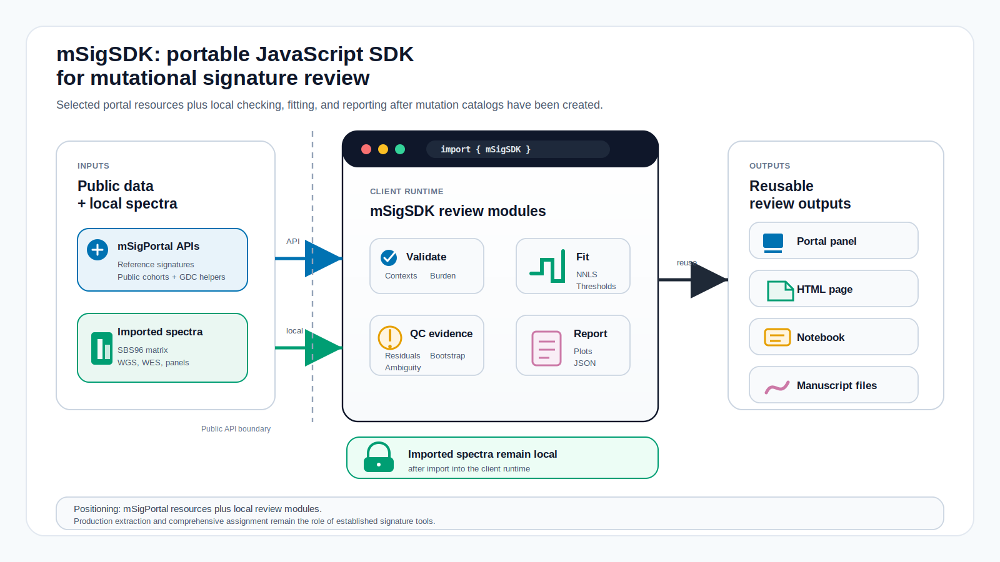
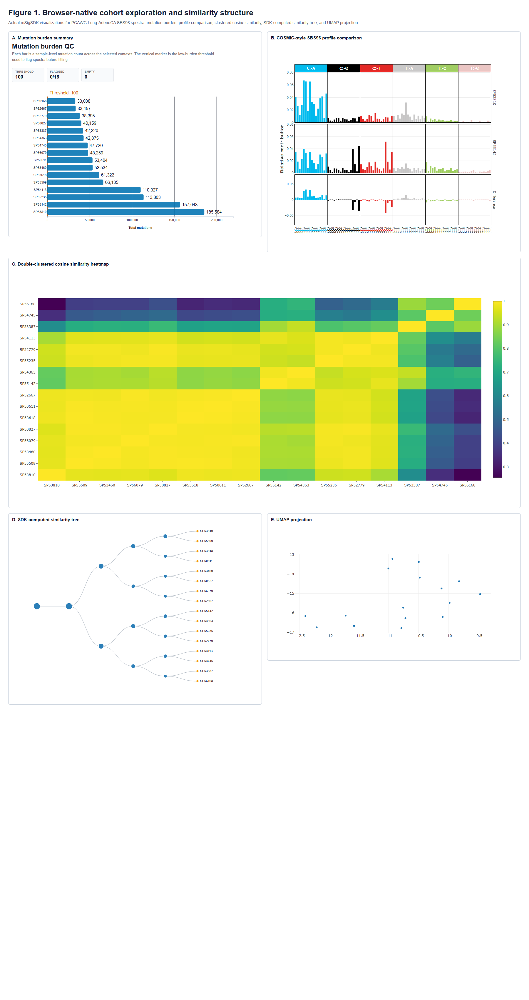
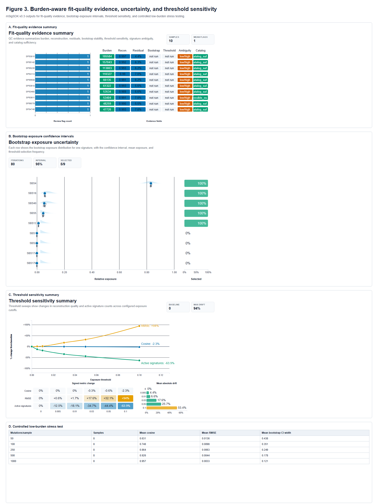
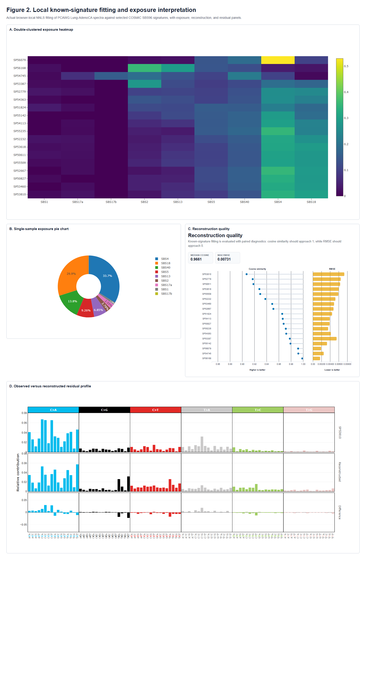
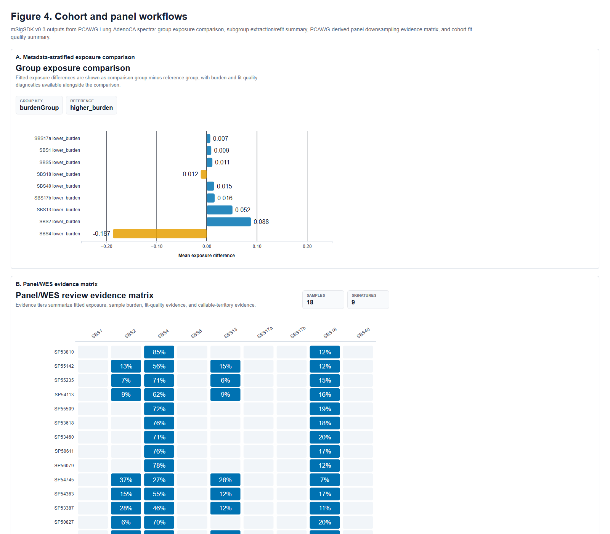
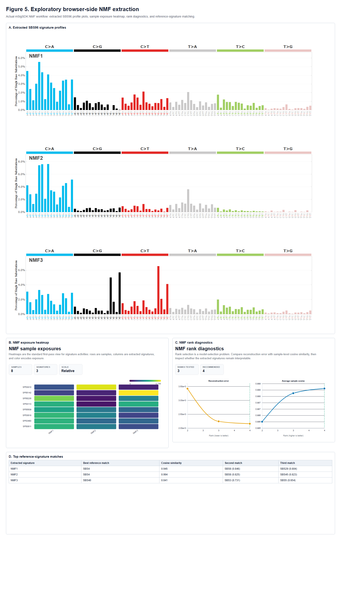

# mSigSDK: a browser-native JavaScript SDK for mutational-signature review, quality control, and reporting

Aaron Ge1,2*, Tongwu Zhang1, Yasmmin Cortes Martins3, Maria Teresa Landi1, Brian Park1, Kailing Chen1, Jeya Balasubramanian1, Jonas S Almeida1

1 Division of Cancer Epidemiology and Genetics, National Cancer Institute, National Institutes of Health, Maryland, USA
2 University of Maryland School of Medicine, Maryland, USA
3 National Laboratory of Scientific Computing, Petropolis, Brazil

*Correspondence: age1@som.umaryland.edu

## Abstract

### Background

Mutational-signature workflows often combine web portals, local R or Python packages, matrix conversion scripts, visualization notebooks, and manual report assembly. This fragmentation makes it difficult to embed signature review in web applications, share reproducible review artifacts, preserve provenance, and distinguish well-supported fitted exposures from estimates that are limited by mutation burden or assay design. Existing tools remain essential for production extraction and assignment, but they do not provide a reusable browser-native review layer for validation, quality control, interoperability, and reporting for precomputed spectra.

### Results

mSigSDK v0.3.0 is a JavaScript software development kit distributed as ECMAScript modules for browser-native mutational-signature review. It retrieves selected public resources from mSigPortal, The Cancer Genome Atlas (TCGA), and the Genomic Data Commons (GDC), imports local spectra or mutation annotation format (MAF)-like rows, validates matrix shape and context completeness, performs known-signature non-negative least-squares (NNLS) refitting, summarizes reconstruction and residual quality, estimates bootstrap uncertainty, evaluates threshold sensitivity, flags signature ambiguity and catalog sufficiency concerns, supports restricted-assay evidence tiers, renders profile-specific plots, and builds provenance-aware reports. MAF conversion preserves legacy SBS96 behavior and can also return SBS1536, DBS78, and ID83 spectra when required row-level evidence is present. SBS profiles can use live 5-base reference windows from the UCSC Genome Browser sequence API; SBS96 uses the centered trinucleotide and SBS1536 uses the full centered pentanucleotide. DBS78 uses explicit dinucleotide substitutions or adjacent SNV pairs, and ID83 uses insertion/deletion alleles with repeat or microhomology annotations when available. In synthetic validation, mean exposure-vector cosine increased from 0.912 at 50 mutations to 0.996 at 1,000 mutations. In a 38-sample PCAWG Lung-AdenoCA concordance analysis, exposure vectors had mean cosine 0.997 against deconstructSigs, 0.907 against SigProfilerAssignment, and 0.973 against MuSiCal SparseNNLS under matched input spectra and a shared nine-signature catalog. In Chrome, a 120-sample cohort workflow ran in a median of 253.7 ms and a 300-sample, 40-signature refit ran in a median of 298.9 ms.

### Conclusions

mSigSDK provides a browser-native review, quality-control, interoperability, and reporting layer for mutational-signature workflows. It complements production extraction and assignment packages by making spectra, fitted exposures, warnings, provenance, and reports easier to embed, inspect, share, and reproduce.

**Keywords:** mutational signatures; JavaScript; browser-native analysis; quality control; provenance; signature refitting; interoperability; mutation annotation format; cancer genomics; software development kit

## Background

Mutational signatures summarize patterns of somatic mutation associated with DNA damage, DNA repair defects, environmental exposures, endogenous mutagenesis, and therapy-related processes [10-13]. Practical signature analyses commonly require several operations: retrieving reference signatures and public cohort spectra, converting mutation rows into profile matrices, fitting known signatures, reviewing reconstruction quality and uncertainty, generating visualizations, and assembling reports. These operations are often distributed across portals, local package environments, scripts, and notebooks, producing workflows with repeated format conversions, incomplete provenance, and outputs that are difficult to embed in another web application or share as reproducible review artifacts.

mSigSDK addresses the review layer of this workflow. It is not a new signature-attribution algorithm and is not a replacement for production extraction or assignment tools. It provides a reusable JavaScript layer for spectra import, validation, refitting, uncertainty review, profile conversion, visualization, interoperability, and reporting in browser-based or local JavaScript environments. This scope is relevant to portal developers adding mutational-signature panels to web applications, computational analysts preparing shareable review pages, laboratories working with restricted assay data, instructors teaching interpretation, and methods developers who need a consistent review surface around their own outputs.

mSigSDK applies FAIR principles at the workflow level [2]. Findability is supported by stable public entry points and versioned documentation. Accessibility is supported by browser execution without requiring each user to install a local R or Python stack. Interoperability is supported by SigProfiler-style, COSMIC-style, MuSiCal-compatible, TSV, JSON, and report JSON Schema outputs. Reusability is supported by explicit parameters, warnings, method-basis fields, provenance, and reproducible manuscript assets.

The software boundary is defined by three runtime tiers. The native JavaScript tier runs spectra import and export, validation, non-negative least squares (NNLS) refitting, quality-control (QC) review, bootstrap and threshold review, panel and whole-exome sequencing (WES) evidence, exploratory non-negative matrix factorization (NMF), plotting, reports, and provenance directly in the browser or a local JavaScript runtime. The optional Pyodide tier can run compatible Python package workflows in a browser worker when package installation, wheel availability, memory, and runtime limits permit. The handoff tier prepares canonical inputs for external tools and parses common outputs back into SDK objects. This separation keeps browser-native behavior distinct from optional package execution and external production workflows.

## Implementation

### Architecture and data boundary

mSigSDK is distributed as a modular JavaScript SDK using ECMAScript modules (Figure 1). Public resources are retrieved from mSigPortal, The Cancer Genome Atlas (TCGA), the Genomic Data Commons (GDC), or the UCSC Genome Browser sequence API when those features are used. Once spectra or mutation annotation format (MAF)-derived matrices are imported into the client runtime, validation, refitting, QC review, uncertainty estimation, panel/WES review, exploratory NMF, plotting, and report generation can run locally. User-supplied spectra can therefore remain in the client runtime after import, although public resource queries and external web assets remain remote dependencies.

**Figure 1. mSigSDK client-side mutational signature review architecture.** mSigSDK uses selected public mSigPortal resources and plotting conventions through reusable JavaScript modules. User-supplied spectra or MAF-derived matrices can be imported into the client runtime for validation, refitting, quality-control review, panel/WES evidence review, plotting, report generation, and external-tool handoff.

### Workflow scope

Table 1 summarizes the main workflows. The primary entry points are organized around public resource access, local spectra review, MAF-to-profile conversion, cohort and panel/WES review, exploratory NMF, interoperability, and reporting.

**Table 1. mSigSDK workflows, inputs, and outputs.**

| Workflow | Intended use | Input requirements | Primary outputs |
| --- | --- | --- | --- |
| Public resource access | Reuse supported mSigPortal and TCGA/GDC public resources outside a single portal session. | Internet access and supported public resources. | Public spectra, signatures, metadata, and portal-style plots. |
| Single-sample review | Inspect a precomputed tumor spectrum before interpretation or sharing. | One profile matrix and a compatible reference catalog. | Burden, context coverage, exposures, reconstruction, residuals, uncertainty, warnings, and report fields. |
| MAF-derived profile conversion | Convert mutation annotation format (MAF)-like rows into profile matrices. | Rows with row-supplied sequence context, a caller-supplied lookup table, or eligible live SBS context lookup when needed. | SBS96, SBS1536, DBS78, and ID83 spectra, row traces, audit summaries, skipped-row reasons, and provenance. |
| Cohort review | Compare spectra and fitted exposures across samples or metadata groups. | Sample-by-context spectra and optional metadata. | Similarity structure, group summaries, exposure comparisons, and cohort-level QC summaries. |
| Panel/WES review | Review signature evidence in restricted assay territory. | Restricted spectra, reference signatures, and optional callable opportunities. | Opportunity-normalized fits, callable-territory evidence, expected fitted mutation counts, and review evidence tiers. |
| Exploratory NMF | Screen moderate cohorts in the browser before production extraction. | Moderate sample-by-context spectra and a rank range. | Extracted profiles, exposures, rank diagnostics, and reference matches. |
| Reporting and handoff | Share reproducible results and interoperate with external tools. | SDK results or compatible matrices. | HTML/JSON reports, provenance, SigProfiler/COSMIC/MuSiCal-compatible files, and parsed external outputs. |

### Computation and privacy boundary

Table 2 distinguishes browser-local review from public-resource retrieval. For supported client-side workflows, imported user spectra can remain local, while remote public data queries and externally loaded web assets remain online dependencies.

**Table 2. Computation locus, external dependencies, and privacy boundary.**

| Workflow | Computed in browser/client runtime | External dependency | Privacy interpretation |
| --- | --- | --- | --- |
| mSigPortal public reference and cohort queries | No, data are retrieved remotely. | mSigPortal API. | Public or portal-hosted data. |
| TCGA/GDC helper queries | No, data are retrieved remotely before conversion. | TCGA/GDC APIs. | Public data and access-governed data remain subject to upstream GDC access rules. |
| User spectra or MAF-derived matrix validation | Yes. | None after import. | User mutation data can remain local. |
| Known-signature NNLS fitting and reconstruction review | Yes. | Optional reference catalog fetch. | User spectra can remain local after reference data are available. |
| Bootstrap, threshold sensitivity, fit-quality review, and residual checks | Yes. | None after import. | Local; runtime scales with iterations, thresholds, and catalog size. |
| Panel/WES opportunity normalization and review evidence tiers | Yes. | None after import. | Local if opportunity data are supplied. |
| Plot rendering, reports, and provenance | Yes. | Browser plotting libraries. | Local unless a user exports or shares outputs. |

### Data model and MAF-derived profiles

The main matrix forms are sample-by-context spectra, signature-by-context reference catalogs, and sample-by-signature exposure matrices. SBS96 follows the pyrimidine-centered COSMIC convention. The validation namespace records expected contexts for committed profile targets, including SBS96, SBS1536, DBS78, and ID83.

The MAF converter is built around the profile registry. `convertMatrix` remains a backward-compatible SBS96 wrapper, while `convertMafToProfileSpectra` returns `spectraByProfile`, `traceByProfile`, audit summaries, warnings, and registry metadata. SBS profiles can use row-supplied context, caller-supplied lookup tables, small bundled lookup assets for reproducible examples, or live 5-base reference windows from the UCSC Genome Browser sequence API for the selected genome build. SBS96 uses the centered trinucleotide from that window, and SBS1536 uses the full centered pentanucleotide. DBS78 counts explicit dinucleotide substitutions or adjacent SNV pairs in the same sample. ID83 counts insertion/deletion alleles with repeat or microhomology annotations when present. Catalog fitting is performed only when the selected catalog profile and matrix match the converted matrix.

### Quality-control and reporting layer

The SDK reports separate evidence fields for mutation burden, context coverage, reconstruction, residual structure, bootstrap stability, threshold sensitivity, signature ambiguity, catalog sufficiency, panel/WES restricted-assay evidence, and cohort subgroup structure. Table 3 lists the default settings used in the manuscript examples. These defaults are configurable.

**Table 3. Algorithmic defaults used in manuscript workflows.**

| Component | Operational setting | Output used in review | Scope note |
| --- | --- | --- | --- |
| Input spectra | Sample-by-context matrices with finite non-negative values; missing and extra contexts are compared with the expected profile context list. | Mutation burden, context completeness, empty-spectrum flags, and low-burden flags. | Applies after spectra have been generated or imported. |
| Known-signature refitting | Coordinate-descent NNLS with relative exposures below 0.01 removed and remaining exposures renormalized in manuscript workflows. | Fitted exposures for a supplied reference catalog. | Catalog-specific refit to supplied signatures. |
| Reconstruction and residuals | Observed and reconstructed spectra compared in relative scale using cosine, RMSE, MAE, L1/L2 error, and maximum residual. | Fit-quality metrics and residual spectra. | Reviewed with burden, uncertainty, and ambiguity fields. |
| Bootstrap uncertainty | Multinomial resampling of the observed spectrum; manuscript examples use 95% intervals. | Exposure means, medians, intervals, and selection frequencies. | Intervals condition on the observed spectrum, supplied catalog, and fitting settings. |
| Threshold sensitivity | Relative exposure thresholds of 0, 0.01, 0.03, 0.05, and 0.10. | Active-signature counts, exposure drift, reconstruction cosine, and RMSE. | Sensitivity analysis across stated cutoffs. |
| Signature ambiguity | Pairwise signature cosine at or above 0.90 is reported; high ambiguity is flagged at nearest-neighbor cosine at least 0.95 or entropy at least 0.92. | Flags for exchangeable or broad reference signatures. | Highlights closely similar reference signatures. |
| Catalog sufficiency | Possible out-of-catalog signal is flagged using unexplained fraction, reconstruction cosine, and structured positive residuals. | Residual patterns and catalog review actions. | Supports catalog and disease-context review. |
| Fit-quality labels | Low burden is below 100 mutations and moderate burden is below 1,000 mutations by default. | Reporting modes and evidence fields. | Aggregates evidence while preserving component metrics. |
| Panel/WES evidence tiers | Minimum assessable burden is 30 mutations; limited-support threshold is 0.05; higher-support threshold is 0.20. | Higher review support, limited review support, not detected within review settings, or not assessable. | Depends on callable territory and burden. |
| Exploratory NMF | Multiplicative-update NMF with fixed ranks or rank sweeps over moderate cohorts in the browser. | Extracted profiles, exposures, diagnostics, and reference matches. | Screening and handoff support. |

Reports are generated as structured JSON or standalone HTML. Report objects include method basis, parameters, validation, QC, warnings, recommended actions, figure descriptors, and provenance. For MAF-derived spectra, provenance records genome build, context source, lookup mode, API endpoint when used, fetch timestamp, cache status, selected profile, and count reconciliation.

## Results

### Browser-native review workflow

PCAWG Lung-AdenoCA SBS96 spectra were retrieved through mSigPortal helpers and reviewed in the browser before refitting (Figure 2). The burden summary, SBS96 profile comparison, clustered cosine similarity heatmap, similarity tree, and UMAP projection were produced from the same imported matrix. The workflow follows the intended review sequence: import spectra, validate shape and burden, inspect cohort structure, then proceed to fitting, uncertainty review, report generation, or external handoff.

**Figure 2. Browser-based cohort exploration of PCAWG Lung-AdenoCA SBS96 spectra.** Mutation burden, SBS96 profile comparison, clustered cosine similarity heatmap, similarity tree, and UMAP projection are produced from the same imported matrix.

### Synthetic exposure recovery

A controlled synthetic experiment generated 64 SBS96 spectra at each of six mutation-burden levels from 50 to 2,500 mutations. Spectra were multinomial draws from linear mixtures of six COSMIC reference signatures, then refitted with the SDK NNLS workflow (Table 4). Mean exposure-vector cosine rose from 0.912 at 50 mutations to 0.996 at 1,000 mutations, and mean reconstruction cosine rose from 0.884 to 0.991 across the same range. These results support browser-side review of known-signature refitting while showing why low-burden spectra require uncertainty estimates and warning fields.

**Table 4. Controlled synthetic exposure-recovery validation.**

| Mutations per sample | Samples (n) | Exposure cosine, mean (95% CI) | Exposure MAE, mean (95% CI) | Active-signature recall, mean (95% CI) | Inactive-signature calls, mean (95% CI) | Reconstruction cosine, mean (95% CI) |
| --- | --- | --- | --- | --- | --- | --- |
| 50 | 64 | 0.912 (0.882-0.941) | 0.065 (0.054-0.075) | 0.938 (0.903-0.972) | 0.165 (0.120-0.211) | 0.884 (0.862-0.906) |
| 100 | 64 | 0.952 (0.932-0.973) | 0.043 (0.034-0.051) | 0.979 (0.959-0.999) | 0.129 (0.085-0.173) | 0.930 (0.915-0.944) |
| 250 | 64 | 0.982 (0.973-0.990) | 0.027 (0.021-0.032) | 0.995 (0.985-1.000) | 0.082 (0.045-0.119) | 0.966 (0.959-0.973) |
| 500 | 64 | 0.993 (0.990-0.996) | 0.016 (0.013-0.020) | 1.000 (1.000-1.000) | 0.026 (0.006-0.046) | 0.982 (0.978-0.986) |
| 1,000 | 64 | 0.996 (0.994-0.997) | 0.013 (0.011-0.016) | 1.000 (1.000-1.000) | 0.027 (0.006-0.049) | 0.991 (0.988-0.993) |
| 2,500 | 64 | 0.998 (0.998-0.999) | 0.008 (0.006-0.010) | 1.000 (1.000-1.000) | 0.017 (0.001-0.033) | 0.996 (0.995-0.997) |

### QC, uncertainty, and restricted-assay evidence

The validation layer was evaluated through fit-quality review, confusable-signature stress testing, and restricted-assay interpretation. In confusable mixtures, reporting modes tracked ground-truth recovery: `standard_qc_passed` had a mean exposure cosine of 0.999, `report_with_caveats` had a mean exposure cosine of 0.989, and `restricted_interpretation` had a mean exposure cosine of 0.947. Bootstrap coverage was below nominal at the lowest mutation burdens and closer to nominal above 250 mutations, consistent with the expected sampling limits of sparse SBS96 profiles.

In PCAWG Lung-AdenoCA examples, fit-quality evidence summarized burden, reconstruction, residual structure, bootstrap intervals, threshold sensitivity, signature ambiguity, and catalog sufficiency (Figure 3).

**Figure 3. Burden-aware fit-quality evidence, uncertainty, and threshold sensitivity.** The workflow reports the evidence fields underlying reporting labels, including bootstrap intervals, threshold sensitivity, residual summaries, and low-burden warnings.

### Numerical correctness and cross-tool concordance

The NNLS solver was compared with an independent R NNLS implementation and reproduced the standard solution to numerical precision. Cross-tool concordance was then evaluated on the same 38 PCAWG Lung-AdenoCA SBS96 spectra and a shared nine-signature COSMIC SBS96 catalog (Table 5). The deconstructSigs comparator had a mean exposure cosine of 0.997 relative to mSigSDK, with 36 of 38 samples sharing the top signature. SigProfilerAssignment and MuSiCal comparisons were also run on the same matrix and catalog. The remaining disagreements were concentrated in spectra with flat or otherwise confusable fitted signatures, supporting the use of cautionary QC fields rather than a simple pass/fail interpretation.

**Table 5. Independent NNLS check and cross-tool concordance on shared PCAWG Lung-AdenoCA spectra.**

| Validation layer | Main result | Supported conclusion |
| --- | --- | --- |
| Independent NNLS solver check | Mean exposure-vector cosine 1.000; maximum absolute exposure difference 4.79e-10. | mSigSDK reproduces the standard NNLS solution to numerical precision. |
| deconstructSigs concordance | Mean exposure cosine 0.997; median 0.998; minimum 0.988; 36 of 38 samples shared the top signature. | The R decomposition comparator was closely aligned with mSigSDK under matched spectra, catalog, cutoff, and renormalization. |
| SigProfilerAssignment concordance | Mean exposure cosine 0.907; median 0.937; minimum 0.556; 29 of 38 samples shared the top signature. | The Python assignment framework agreed for most spectra, with remaining disagreements concentrated in confusable flat-signature fits. |
| MuSiCal SparseNNLS concordance | Mean exposure cosine 0.973; median 0.997; minimum 0.855; 37 of 38 samples shared the top signature. | The sparse likelihood-based comparator served as an additional refitting comparator on the same spectra and catalog. |
| Reconstruction concordance | Mean reconstruction cosine: mSigSDK 0.982; deconstructSigs 0.982; SigProfilerAssignment 0.974; MuSiCal 0.981. | All reconstruction metrics are computed against the same observed spectra and selected nine-signature catalog. |
| Ambiguity-flag prediction | 0 of 2 deconstructSigs-discordant, high-ambiguity samples also showed MuSiCal-vs-mSigSDK top-signature disagreement; MuSiCal-vs-mSigSDK top-signature disagreement occurred in 1 of 38 samples overall. | Ambiguity signals are interpreted as cautionary evidence rather than proof of a specific comparator disagreement. |

**Figure 4. Local known-signature refitting against nine COSMIC SBS96 reference signatures.** The exposure heatmap, selected sample profile, reconstruction summary, and residual view provide a browser-side review surface for fitted spectra.

### Panel and cohort review

For panel/WES review, callable-context downsampling showed that panel-vs-WGS exposure agreement increased with context breadth. Mean panel-vs-WGS exposure cosine rose from 0.813 with a 24-context mask to 0.899 with 48 contexts and 0.959 with 72 contexts. The `not_assessable` tier separated insufficient mutation burden or callable territory from an absent fitted signal (Figure 5). The same workflow also supports metadata-stratified exposure comparisons and cohort subgroup review.

**Figure 5. Cohort and panel workflows.** Metadata-stratified exposure comparison, panel evidence matrix, fit-quality summary, and cohort subgroup review generated by mSigSDK.

### Runtime of interactive review tasks

Browser and Node.js benchmarks used deterministic synthetic SBS96 matrices sized to common review scenarios. Timings excluded plot rendering. Chrome was measured using a standalone browser harness; Firefox was requested but no local Firefox executable was available. The measured Chrome timings support interactive use for validation, refitting, panel/WES review, moderate cohort review, and NMF screening in the browser. Larger NMF analyses and repeated uncertainty workflows are more suitable for background Web Workers or local execution.

**Table 6. Scenario-calibrated local compute summary.**

| Scenario | Workflow step | Samples and settings | Chrome median (range) | Node.js median (range) |
| --- | --- | --- | --- | --- |
| Single-sample WGS review | Known-signature refitting | 1 sample; 5,000 mutations/sample; 24 signatures | 1.2 ms (1.1-5.5) | 6.7 ms (0.5-7.6) |
| Single-sample WGS review | Bootstrap uncertainty | 1 sample; 500 iterations; 24 signatures | 391.8 ms (373.5-470.0) | 337.2 ms (328.4-415.3) |
| Small panel/WES batch | Full panel/WES review workflow | 24 samples; 80 mutations/sample; 12 signatures | 21.6 ms (21.4-22.2) | 25.6 ms (24.0-30.5) |
| Medium research cohort | Cohort fit workflow | 120 samples; 1,200 mutations/sample; 24 signatures | 253.7 ms (252.0-279.2) | 253.2 ms (247.0-270.8) |
| Portal-scale cohort review | Known-signature refitting | 300 samples; 1,500 mutations/sample; 40 signatures | 298.9 ms (294.2-358.1) | 232.3 ms (223.9-256.1) |
| Exploratory discovery cohort | NMF rank selection | 30 samples; ranks 2, 3, and 4; 75 iterations | 576.0 ms (556.7-611.0) | 491.2 ms (477.4-595.1) |
| Medium exploratory discovery cohort | NMF rank selection | 80 samples; ranks 2, 3, and 4; 75 iterations | 2.88 s (2.52-2.90) | 2.15 s (2.05-2.17) |

### Exploratory extraction in the browser

The exploratory NMF module decomposed a PCAWG Lung-AdenoCA subset over candidate ranks and reported extracted profiles, exposures, rank diagnostics, and reference-signature matches (Figure 6). This workflow is intended for screening and instructional use. Production de novo discovery still requires dedicated extraction workflows, disease-specific stability checks, and larger validation.

**Figure 6. Exploratory browser-side NMF extraction.** mSigSDK NMF extraction, rank diagnostics, and reference matching for a moderate-sized PCAWG Lung-AdenoCA subset.

## Discussion

mSigSDK v0.3.0 fills a software gap between public mutational-signature resources and full local analysis toolchains. It makes common review tasks portable: spectra import, context validation, MAF-derived profile conversion, known-signature refitting, uncertainty review, panel/WES evidence, exploratory NMF, figure generation, report assembly, and provenance capture. The validation and benchmark results support three practical claims. First, the SDK can run realistic review workflows in a browser or local JavaScript runtime. Second, its NNLS solver and matched-input refitting behavior agree with established numerical and package-based comparators. Third, its reporting fields make burden, uncertainty, ambiguity, context provenance, and assay limitations visible before biological interpretation.

The comparison with related tools is functional, not hierarchical (Table 7). SigProfilerExtractor remains the appropriate production tool for de novo extraction and stability analysis. SigProfilerAssignment remains a full assignment framework with local Python as the production path. deconstructSigs and MuSiCal remain established R/Python ecosystem tools for decomposition and sparse refitting. mSigSDK complements these packages by preparing compatible matrices, parsing outputs, comparing results using a shared context order, and generating review artifacts that can be embedded in portals, notebooks, teaching pages, or manuscript workflows.

**Table 7. Functional positioning relative to related mutational-signature software.**

| Tool or platform | Primary role | Browser execution | Interoperability with mSigSDK | QC/reporting layer |
| --- | --- | --- | --- | --- |
| mSigSDK | Browser-native review SDK for spectra import, validation, profile conversion, NNLS refitting, QC, panel review, exploratory NMF, interoperability, and reporting. | Yes, JavaScript core; optional Pyodide for compatible Python packages. | Native nested matrices plus SigProfiler, COSMIC, MuSiCal-compatible, and report JSON Schema outputs. | Structured warnings, fit-quality evidence, recommended actions, figures, and provenance. |
| mSigPortal | Public mutational-signature portal and API. | Portal hosted. | mSigSDK retrieves public mSigPortal spectra and signatures and reuses selected plotting conventions. | Portal-specific. |
| SigProfilerExtractor | Production de novo mutational-signature extraction. | Not directly; used through local Python or server execution. | mSigSDK exports matrix inputs, creates a runnable Python script, and parses extracted signature and exposure TSV outputs. | SigProfilerExtractor stability diagnostics plus mSigSDK screening and report metadata. |
| deconstructSigs | R-based known-signature decomposition. | Not directly; used through local R or external execution. | mSigSDK exports deconstructSigs-compatible TSV inputs and parses sample-by-signature exposure tables. | deconstructSigs fit outputs plus mSigSDK uncertainty, threshold sensitivity, and provenance. |
| SigProfilerAssignment | Known-signature assignment against a supplied catalog. | Optional browser execution through Pyodide matrix-mode runs when package installation and dependencies succeed; local Python remains the production path. | mSigSDK prepares matrix-mode input, can run compatible Pyodide sessions, and parses exposure outputs. | Assignment metrics plus mSigSDK ambiguity, low-burden, and report fields. |
| MuSiCal | Sparse likelihood-based mutational-signature refitting and discovery. | Package execution depends on Pyodide-compatible wheels; mSigSDK includes a browser-native MuSiCal-compatible sparse NNLS comparator. | mSigSDK exports/imports MuSiCal-style matrices and compares sparse refits on the same spectra/catalog. | MuSiCal metrics from the external tool or comparator plus mSigSDK ambiguity and reporting fields. |

Several limitations remain. mSigSDK does not introduce a new attribution algorithm and does not replace production-scale extraction, mutation-level assignment, or disease-specific validation. Unregularized NNLS can distribute small exposures across similar or flat signatures; mSigSDK reports ambiguity and uncertainty but does not impose a sparse prior. Browser runtime depends on device speed, memory, browser version, catalog size, and workflow settings. MAF conversion depends on correct genome build, coordinate conventions, and reference context availability; offline deployments should supply project-specific context lookup tables rather than relying on bundled example lookup assets. Panel/WES evidence labels depend on assay design, callable territory, mutation burden, and signature-specific callable context coverage.

## Conclusions

mSigSDK v0.3.0 is a browser-native JavaScript SDK for mutational-signature review, quality control, interoperability, and provenance-aware reporting. It supports portable use of mSigPortal resources, local review of imported spectra, MAF-derived SBS96/SBS1536/DBS78/ID83 conversion, known-signature refitting, uncertainty review, panel/WES evidence tiers, exploratory NMF, and structured report generation. The SDK provides an embeddable review layer that supports inspection, sharing, and reproduction of signature workflows while preserving a clear boundary between browser-native computation, optional Pyodide execution, and external-tool handoff.

## Availability and requirements

Project name: mSigSDK

Project home page: https://github.com/episphere/msig

Archived version: GitHub release/tag pending for the final BMC submission snapshot; no DOI is claimed until one exists.

Operating systems: Platform independent.

Programming language: JavaScript (ECMAScript modules).

Current software version: 0.3.0.

Other requirements: A modern browser with JavaScript module support for browser use, or Node.js for local JavaScript execution. Internet access is required for mSigPortal, TCGA/GDC, and UCSC Genome Browser API queries when those public resources are used. User-supplied spectra and MAF-derived matrices can be reviewed locally after import.

License: MIT.

Restrictions for non-academic use: None.

## List of abbreviations

API: application programming interface.

COSMIC: Catalogue of Somatic Mutations in Cancer.

DBS: double-base substitution.

GDC: Genomic Data Commons.

HTML: Hypertext Markup Language.

ID: insertion/deletion.

JSON: JavaScript Object Notation.

MAF: mutation annotation format.

NMF: non-negative matrix factorization.

NNLS: non-negative least squares.

QC: quality control.

SBS: single-base substitution.

SDK: software development kit.

TCGA: The Cancer Genome Atlas.

WES: whole-exome sequencing.

WGS: whole-genome sequencing.

## Declarations

### Ethics approval and consent to participate

Not applicable.

### Consent for publication

Not applicable.

### Availability of data and materials

The mSigSDK source code, example notebooks, manuscript figure generators, generated tables, benchmark outputs, and validation outputs are available in the project repository at https://github.com/episphere/msig. Public demonstration spectra and signatures are retrieved from mSigPortal through public API calls. TCGA/GDC helper workflows use public GDC endpoints where applicable. The final submission snapshot will be identified by a GitHub release/tag.

### Competing interests

### Funding

### Authors' contributions

### Acknowledgements

### Use of AI-assisted technologies

## References

1. Zhang T, Sang J, Cho P, Jiang K, Landi MT. Integrative mutational signature portal (mSigPortal) for cancer genomic study. Cancer Res. 2021;81(13 Supplement):211. doi:10.1158/1538-7445.AM2021-211.
2. Wilkinson MD, et al. The FAIR Guiding Principles for scientific data management and stewardship. Sci Data. 2016;3:160018. doi:10.1038/sdata.2016.18.
3. Grossman RL. Data lakes, clouds, and commons: a review of platforms for analyzing and sharing genomic data. Trends Genet. 2019;35:223-234. doi:10.1016/j.tig.2018.12.006.
4. Ruan E, et al. PLCOjs, a FAIR GWAS web SDK for the NCI Prostate, Lung, Colorectal and Ovarian Cancer Genetic Atlas project. Bioinformatics. 2022;38:4434-4436. doi:10.1093/bioinformatics/btac531.
5. Almeida JS, Hajagos J, Saltz J, Saltz M. Serverless OpenHealth at data commons scale: traversing the 20 million patient records of New York's SPARCS dataset in real-time. PeerJ. 2019;7:e6230. doi:10.7717/peerj.6230.
6. Almeida JS, et al. Mortality tracker: the COVID-19 case for real time web APIs as epidemiology commons. Bioinformatics. 2021;37:2073-2074. doi:10.1093/bioinformatics/btaa933.
7. Jensen MA, Ferretti V, Grossman RL, Staudt LM. The NCI Genomic Data Commons as an engine for precision medicine. Blood. 2017;130:453-459. doi:10.1182/blood-2017-03-735654.
8. Hoadley KA, et al. Cell-of-origin patterns dominate the molecular classification of 10,000 tumors from 33 types of cancer. Cell. 2018;173:291-304.e6. doi:10.1016/j.cell.2018.03.022.
9. de Bruijn I, et al. Analysis and visualization of longitudinal genomic and clinical data from the AACR Project GENIE Biopharma Collaborative in cBioPortal. Cancer Res. 2023;83:3861-3867. doi:10.1158/0008-5472.CAN-23-0816.
10. Alexandrov LB, et al. The repertoire of mutational signatures in human cancer. Nature. 2020;578:94-101. doi:10.1038/s41586-020-1943-3.
11. Landi MT, et al. Tracing lung cancer risk factors through mutational signatures in never-smokers: the Sherlock-Lung Study. Am J Epidemiol. 2021;190:962-976. doi:10.1093/aje/kwaa234.
12. Pich O, Muinos F, Lolkema MP, Steeghs N, Gonzalez-Perez A, Lopez-Bigas N. The mutational footprints of cancer therapies. Nat Genet. 2019;51:1732-1740. doi:10.1038/s41588-019-0525-5.
13. Koh G, Degasperi A, Zou X, Momen S, Nik-Zainal S. Mutational signatures: emerging concepts, caveats and clinical applications. Nat Rev Cancer. 2021;21:619-637. doi:10.1038/s41568-021-00377-7.
14. Koh G, Zou X, Nik-Zainal S. Mutational signatures: experimental design and analytical framework. Genome Biol. 2020;21:37. doi:10.1186/s13059-020-1951-5.
15. Medo M, Ng CKY, Medova M. A comprehensive comparison of tools for fitting mutational signatures. Nat Commun. 2024;15:9467. doi:10.1038/s41467-024-53711-6.
16. Lawrence L, Kunder CA, Fung E, Stehr H, Zehnder J. Performance characteristics of mutational signature analysis in targeted panel sequencing. Arch Pathol Lab Med. 2021;145:1424-1431. doi:10.5858/arpa.2020-0536-OA.
17. Jin H, Gulhan DC, Geiger B, et al. Accurate and sensitive mutational signature analysis with MuSiCal. Nat Genet. 2024;56:541-552. doi:10.1038/s41588-024-01659-0.
18. Wu AJ, Perera A, Kularatnarajah L, Korsakova A, Pitt JJ. Mutational signature assignment heterogeneity is widespread and can be addressed by ensemble approaches. Brief Bioinform. 2023;24:bbad331. doi:10.1093/bib/bbad331.
19. Degasperi A, et al. A practical framework and online tool for mutational signature analyses show inter-tissue variation and driver dependencies. Nat Cancer. 2020;1:249-263. doi:10.1038/s43018-020-0027-5.
20. Diaz-Gay M, et al. Assigning mutational signatures to individual samples and individual somatic mutations with SigProfilerAssignment. Bioinformatics. 2023;39:btad756. doi:10.1093/bioinformatics/btad756.
21. Blokzijl F, Janssen R, van Boxtel R, Cuppen E. MutationalPatterns: comprehensive genome-wide analysis of mutational processes. Genome Med. 2018;10:33. doi:10.1186/s13073-018-0539-0.
22. Rosenthal R, et al. deconstructSigs: delineating mutational processes in single tumors distinguishes DNA repair deficiencies and patterns of carcinoma evolution. Genome Biol. 2016;17:31. doi:10.1186/s13059-016-0893-4.
23. Islam SMA, et al. Uncovering novel mutational signatures by de novo extraction with SigProfilerExtractor. Cell Genomics. 2022;2:100179. doi:10.1016/j.xgen.2022.100179.
